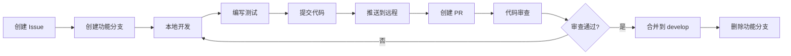

# AlertProcessor 团队并行开发规范

## 📋 目录

1. [分支策略](#分支策略)
2. [开发流程](#开发流程)
3. [代码规范](#代码规范)
4. [协作规范](#协作规范)
5. [检测器开发规范](#检测器开发规范)
6. [测试规范](#测试规范)
7. [发布流程](#发布流程)

---

## 🌳 分支策略

### 主要分支

#### `master` - 生产分支
- **用途**: 生产环境代码，始终保持稳定可发布状态
- **保护规则**: 
  - 禁止直接推送
  - 必须通过 PR 合并
  - 至少 1 人审查通过
  - 所有 CI 检查通过
- **合并来源**: 仅接受来自 `release/*` 或 `hotfix/*` 的合并

#### `develop` - 开发主分支
- **用途**: 集成所有功能开发，作为下一个版本的基础
- **保护规则**:
  - 禁止直接推送
  - 必须通过 PR 合并
  - 至少 1 人审查通过
  - 所有测试通过
- **合并来源**: 接受来自 `feature/*`, `bugfix/*` 的合并

### 临时分支

#### `feature/*` - 功能分支
- **命名规范**: `feature/<issue-id>-<short-description>`
  - 示例: `feature/123-add-bridge-attack-detector`
- **生命周期**: 功能开发完成并合并到 `develop` 后删除
- **分支来源**: 从 `develop` 创建
- **合并目标**: 合并回 `develop`

#### `bugfix/*` - 缺陷修复分支
- **命名规范**: `bugfix/<issue-id>-<short-description>`
  - 示例: `bugfix/456-fix-fund-drain-threshold`
- **生命周期**: 修复完成并合并后删除
- **分支来源**: 从 `develop` 创建
- **合并目标**: 合并回 `develop`

#### `hotfix/*` - 紧急修复分支
- **命名规范**: `hotfix/<version>-<short-description>`
  - 示例: `hotfix/1.2.1-fix-critical-false-positive`
- **生命周期**: 修复完成并合并后删除
- **分支来源**: 从 `master` 创建
- **合并目标**: 同时合并回 `master` 和 `develop`

#### `release/*` - 发布分支
- **命名规范**: `release/<version>`
  - 示例: `release/1.3.0`
- **生命周期**: 发布完成后删除
- **分支来源**: 从 `develop` 创建
- **合并目标**: 合并回 `master` 和 `develop`

---

## 🔄 开发流程

### 1. 功能开发流程



#### 详细步骤

**Step 1: 创建 Issue**
```bash
# 在 GitHub/GitLab 上创建 Issue，描述功能需求
# 标签: enhancement, detector, frontend, backend 等
```

**Step 2: 创建功能分支**
```bash
# 确保 develop 是最新的
git checkout develop
git pull origin develop

# 创建功能分支
git checkout -b feature/123-add-bridge-attack-detector
```

**Step 3: 本地开发**
```bash
# 开发功能，遵循代码规范
# 定期提交，保持提交粒度合理
git add <files>
git commit -m "feat: add BridgeAttackDetector base structure"
```

**Step 4: 编写测试**
```bash
# 为新功能编写单元测试和集成测试
# 测试文件: tests/detectors/test_bridge_attack_detector.py
pytest tests/detectors/test_bridge_attack_detector.py
```

**Step 5: 推送到远程**
```bash
# 推送功能分支
git push -u origin feature/123-add-bridge-attack-detector
```

**Step 6: 创建 Pull Request**
- 使用 PR 模板（见下文）
- 填写完整的描述、测试计划、截图等
- 关联相关 Issue

**Step 7: 代码审查**
- 至少 1 人审查
- 使用代码审查清单（见下文）
- 及时响应审查意见

**Step 8: 合并**
```bash
# 审查通过后，使用 Squash and Merge
# 合并后自动删除功能分支
```

### 2. 并行开发协调

#### 场景 1: 多人开发不同检测器
```bash
# 开发者 A: 开发 BridgeAttackDetector
git checkout -b feature/123-bridge-attack-detector

# 开发者 B: 开发 FlashLoanDetector
git checkout -b feature/124-flash-loan-detector

# 开发者 C: 优化前端界面
git checkout -b feature/125-improve-ui

# 互不干扰，各自开发、测试、提交 PR
```

#### 场景 2: 多人开发同一模块
```bash
# 开发者 A: 负责检测器核心逻辑
git checkout -b feature/123-detector-core

# 开发者 B: 负责检测器测试
git checkout -b feature/123-detector-tests

# 协调: 
# - A 先完成核心逻辑并合并
# - B 基于最新的 develop 继续开发测试
```

#### 场景 3: 依赖关系处理
```bash
# 功能 A 依赖功能 B

# 方案 1: 串行开发（推荐）
# 1. 先完成功能 B，合并到 develop
# 2. 再开发功能 A

# 方案 2: 并行开发（高级）
# 1. 功能 B 开发中，功能 A 从功能 B 的分支创建
git checkout feature/124-base-feature
git checkout -b feature/125-dependent-feature

# 2. 功能 B 合并后，功能 A rebase 到 develop
git checkout feature/125-dependent-feature
git rebase develop
```

---

## 📝 代码规范

### Python 代码规范

#### 1. 代码风格
- **格式化工具**: Black (line-length=100)
- **Linter**: Ruff
- **类型检查**: mypy

```bash
# 格式化代码
black nodes/ engine/ routers/

# 检查代码质量
ruff check nodes/ engine/ routers/

# 类型检查
mypy nodes/ engine/ routers/
```

#### 2. 命名规范
```python
# 类名: PascalCase
class BridgeAttackDetector:
    pass

# 函数名: snake_case
def calculate_risk_score():
    pass

# 常量: UPPER_SNAKE_CASE
MAX_THRESHOLD = 100.0

# 私有方法: _leading_underscore
def _internal_helper():
    pass

# 类型变量: PascalCase
T = TypeVar('T')
```

#### 3. 文档字符串
```python
def detect_attack(tx_data: dict) -> DetectionResult:
    """
    检测交易是否为攻击
    
    Args:
        tx_data: 交易数据，包含 hash, from, to, value 等字段
        
    Returns:
        DetectionResult: 检测结果，包含 is_attack, score, reason
        
    Raises:
        ValueError: 当 tx_data 缺少必需字段时
    """
    pass
```

#### 4. 导入顺序
```python
# 1. 标准库
import os
import sys
from typing import Any, Dict

# 2. 第三方库
import numpy as np
from pydantic import BaseModel

# 3. 本地模块
from nodes.base import BaseNode
from engine.executor import Executor
```

### 前端代码规范

#### 1. Vue 组件结构
```vue
<template>
  <!-- 模板 -->
</template>

<script setup>
// 导入
import { ref, computed } from 'vue'

// Props
const props = defineProps({
  nodeId: String
})

// State
const isLoading = ref(false)

// Computed
const displayName = computed(() => props.nodeId.toUpperCase())

// Methods
function handleClick() {
  // ...
}
</script>

<style scoped>
/* 样式 */
</style>
```

#### 2. 命名规范
```javascript
// 组件名: PascalCase
NodeCard.vue

// 文件名: kebab-case
use-connection.js

// 变量名: camelCase
const nodeTypes = ref([])

// 常量: UPPER_SNAKE_CASE
const MAX_NODES = 100
```

### 提交信息规范

#### Conventional Commits 格式
```
<type>(<scope>): <subject>

<body>

<footer>
```

#### Type 类型
- `feat`: 新功能
- `fix`: 缺陷修复
- `refactor`: 重构（不改变功能）
- `perf`: 性能优化
- `style`: 代码格式（不影响功能）
- `test`: 测试相关
- `docs`: 文档更新
- `chore`: 构建/工具链更新

#### 示例
```bash
# 新功能
git commit -m "feat(detector): add BridgeAttackDetector with signature analysis"

# 缺陷修复
git commit -m "fix(fund-drain): correct threshold calculation for small transfers"

# 重构
git commit -m "refactor(arbitrary-call): extract signature analysis to separate module"

# 文档
git commit -m "docs: add development workflow guide"

# 多行提交
git commit -m "feat(detector): add dynamic signature recognition

- Integrate 4bytes.directory API
- Add keyword-based function name analysis
- Implement context feature scoring
- Add whitelist filtering mechanism

Closes #123"
```

---

## 🤝 协作规范

### Pull Request 模板

创建 `.github/pull_request_template.md`:

```markdown
## 📝 变更描述

<!-- 简要描述本次 PR 的目的和内容 -->

## 🎯 关联 Issue

Closes #<issue-number>

## 🔧 变更类型

- [ ] 新功能 (feat)
- [ ] 缺陷修复 (fix)
- [ ] 重构 (refactor)
- [ ] 性能优化 (perf)
- [ ] 文档更新 (docs)
- [ ] 测试 (test)
- [ ] 其他 (chore)

## 📋 变更清单

- [ ] 添加/修改了 XXX 功能
- [ ] 修复了 XXX 问题
- [ ] 重构了 XXX 模块

## 🧪 测试计划

### 单元测试
- [ ] 添加了新的单元测试
- [ ] 所有单元测试通过

### 集成测试
- [ ] 添加了集成测试
- [ ] 测试覆盖了主要场景

### 手动测试
- [ ] 测试了正常流程
- [ ] 测试了边界情况
- [ ] 测试了错误处理

## 📊 性能影响

<!-- 如果涉及性能变更，请说明 -->
- 检测延迟: 无影响 / 提升 X% / 降低 X%
- 内存使用: 无影响 / 增加 X MB / 减少 X MB

## 🔍 代码审查清单

- [ ] 代码遵循项目规范
- [ ] 添加了必要的注释
- [ ] 更新了相关文档
- [ ] 没有引入新的警告
- [ ] 通过了所有 CI 检查

## 📸 截图/演示

<!-- 如果是 UI 变更，请提供截图或 GIF -->

## 🚨 破坏性变更

<!-- 如果有破坏性变更，请详细说明 -->
- [ ] 无破坏性变更
- [ ] 有破坏性变更（请在下方说明）

## 📝 额外说明

<!-- 其他需要说明的内容 -->
```

### 代码审查清单

#### 功能性审查
- [ ] 代码实现了 PR 描述的功能
- [ ] 代码逻辑正确，没有明显的 bug
- [ ] 边界情况处理得当
- [ ] 错误处理完善

#### 代码质量审查
- [ ] 代码可读性好，命名清晰
- [ ] 没有重复代码
- [ ] 函数/方法职责单一
- [ ] 复杂逻辑有注释说明

#### 安全性审查
- [ ] 没有 SQL 注入风险
- [ ] 没有 XSS 风险
- [ ] 敏感数据处理得当
- [ ] 输入验证完善

#### 性能审查
- [ ] 没有明显的性能问题
- [ ] 数据库查询优化
- [ ] 避免了 N+1 查询
- [ ] 大数据量处理得当

#### 测试审查
- [ ] 测试覆盖率足够
- [ ] 测试用例有代表性
- [ ] 测试数据合理
- [ ] 测试可维护

#### 文档审查
- [ ] 代码注释充分
- [ ] API 文档更新
- [ ] README 更新（如需要）
- [ ] 变更日志更新

---

## 🔬 检测器开发规范

### 检测器目录结构
```
nodes/detectors/
├── __init__.py
├── base.py                    # 基类
├── protocol/                  # 协议层检测器
│   ├── __init__.py
│   ├── arbitrary_call.py
│   ├── access_control.py
│   └── ...
├── economic/                  # 经济层检测器
│   ├── __init__.py
│   ├── fund_drain.py
│   ├── price_manipulation.py
│   └── ...
└── behavioral/                # 行为层检测器
    ├── __init__.py
    ├── gas_price.py
    └── ...
```

### 检测器开发步骤

#### Step 1: 创建检测器类
```python
# nodes/detectors/protocol/bridge_attack.py

from nodes.detectors.base import BaseProtocolAttackDetector
from pydantic import Field

class BridgeAttackDetector(BaseProtocolAttackDetector):
    """跨链桥攻击检测器"""
    
    class ConfigModel(BaseProtocolAttackDetector.ConfigModel):
        threshold: float = Field(default=70.0, ge=0.0, le=100.0)
        check_validator_signatures: bool = Field(default=True)
        check_message_replay: bool = Field(default=True)
    
    def _detect_patterns(self, data: dict) -> list[PatternMatch]:
        """检测攻击模式"""
        matches = []
        
        # 实现检测逻辑
        if self._check_validator_attack(data):
            matches.append(PatternMatch(
                pattern_name="validator_compromise",
                confidence=0.9,
                score_contribution=45.0,
                evidence={"reason": "验证者签名异常"}
            ))
        
        return matches
    
    def _calculate_score(self, matches: list[PatternMatch]) -> float:
        """计算风险评分"""
        return sum(m.score_contribution for m in matches)
```

#### Step 2: 注册检测器
```python
# nodes/detectors/__init__.py

from nodes.detectors.protocol.bridge_attack import BridgeAttackDetector

DETECTOR_REGISTRY = {
    "bridge_attack_detector": BridgeAttackDetector,
    # ...
}
```

#### Step 3: 编写测试
```python
# tests/detectors/test_bridge_attack_detector.py

import pytest
from nodes.detectors.protocol.bridge_attack import BridgeAttackDetector

def test_validator_compromise_detection():
    """测试验证者攻击检测"""
    detector = BridgeAttackDetector(config={"threshold": 70.0})
    
    # 准备测试数据
    data = {
        "eth_trace": {
            "validator_signatures": ["0xabc...", "0xdef..."],
            "expected_validators": ["0x123...", "0x456..."]
        }
    }
    
    # 执行检测
    result = detector.execute(data)
    
    # 断言
    assert result["is_attack"] is True
    assert result["score"] >= 70.0
    assert "validator_compromise" in result["matched_patterns"]

def test_normal_bridge_transaction():
    """测试正常跨链桥交易"""
    detector = BridgeAttackDetector(config={"threshold": 70.0})
    
    data = {
        "eth_trace": {
            "validator_signatures": ["0x123...", "0x456..."],
            "expected_validators": ["0x123...", "0x456..."]
        }
    }
    
    result = detector.execute(data)
    
    assert result["is_attack"] is False
    assert result["score"] < 70.0
```

#### Step 4: 创建规则链
```python
# scripts/create_bridge_attack_rule_chain.py

import sqlite3

def create_rule_chain():
    conn = sqlite3.connect("alerts.db")
    cursor = conn.cursor()
    
    chain_config = {
        "nodes": {
            "trigger": {"type": "alert_trigger"},
            "trace_provider": {"type": "eth_trace_provider"},
            "detector": {
                "type": "bridge_attack_detector",
                "config": {"threshold": 70.0}
            },
            "set_severity": {
                "type": "set_severity",
                "config": {"severity": "CRITICAL"}
            }
        },
        "edges": [
            {"from": "trigger", "to": "trace_provider"},
            {"from": "trace_provider", "to": "detector"},
            {"from": "detector", "to": "set_severity"}
        ]
    }
    
    cursor.execute("""
        INSERT INTO rule_chains (name, description, config, enabled)
        VALUES (?, ?, ?, ?)
    """, (
        "Bridge Attack Detection",
        "检测跨链桥攻击（验证者攻击、消息伪造、重放攻击）",
        json.dumps(chain_config),
        1
    ))
    
    conn.commit()
    conn.close()

if __name__ == "__main__":
    create_rule_chain()
```

#### Step 5: 编写文档
```markdown
# BridgeAttackDetector

## 功能描述
检测跨链桥攻击，包括验证者攻击、消息伪造、重放攻击等。

## 检测模式
1. **验证者攻击**: 验证者签名异常或被攻陷
2. **消息伪造**: 跨链消息未经验证或伪造
3. **重放攻击**: 相同消息被重复执行

## 配置参数
- `threshold`: 报警阈值（默认 70.0）
- `check_validator_signatures`: 是否检查验证者签名（默认 true）
- `check_message_replay`: 是否检查消息重放（默认 true）

## 使用示例
\`\`\`python
detector = BridgeAttackDetector(config={
    "threshold": 70.0,
    "check_validator_signatures": True
})

result = detector.execute(data)
\`\`\`

## 测试用例
- 验证者攻击检测
- 消息伪造检测
- 重放攻击检测
- 正常交易不误报
```

---

## 🧪 测试规范

### 测试目录结构
```
tests/
├── unit/                      # 单元测试
│   ├── detectors/
│   ├── nodes/
│   └── engine/
├── integration/               # 集成测试
│   ├── test_rule_chain_execution.py
│   └── test_end_to_end.py
└── fixtures/                  # 测试数据
    ├── transactions/
    ├── traces/
    └── knowledge_base/
```

### 测试覆盖率要求
- **核心模块**: ≥ 80%
- **检测器**: ≥ 90%
- **工具函数**: ≥ 70%

### 测试命名规范
```python
# 格式: test_<功能>_<场景>_<预期结果>

def test_fund_drain_detector_large_transfer_should_alert():
    """测试大额转账应该报警"""
    pass

def test_fund_drain_detector_small_transfer_should_not_alert():
    """测试小额转账不应该报警"""
    pass

def test_arbitrary_call_detector_whitelist_address_should_not_alert():
    """测试白名单地址不应该报警"""
    pass
```

### 测试数据管理
```python
# tests/fixtures/transactions.py

import pytest

@pytest.fixture
def ronin_bridge_attack_tx():
    """Ronin Bridge 攻击交易数据"""
    return {
        "hash": "0x...",
        "from": "0x...",
        "to": "0x...",
        "value": "173600000000000000000000",
        "eth_trace": {
            # ...
        }
    }

@pytest.fixture
def normal_uniswap_swap_tx():
    """正常的 Uniswap Swap 交易"""
    return {
        "hash": "0x...",
        # ...
    }
```

---

## 🚀 发布流程

### 版本号规范
遵循 [Semantic Versioning 2.0.0](https://semver.org/)

- **MAJOR.MINOR.PATCH** (例如: 1.3.2)
  - **MAJOR**: 不兼容的 API 变更
  - **MINOR**: 向后兼容的功能新增
  - **PATCH**: 向后兼容的缺陷修复

### 发布步骤

#### Step 1: 创建发布分支
```bash
# 从 develop 创建发布分支
git checkout develop
git pull origin develop
git checkout -b release/1.3.0
```

#### Step 2: 更新版本号和变更日志
```bash
# 更新 version.py
echo "__version__ = '1.3.0'" > version.py

# 更新 CHANGELOG.md
# 添加本次发布的变更内容
```

#### Step 3: 测试
```bash
# 运行所有测试
pytest tests/

# 运行集成测试
pytest tests/integration/

# 手动测试关键功能
```

#### Step 4: 合并到 master
```bash
# 创建 PR: release/1.3.0 -> master
# 审查通过后合并
git checkout master
git merge --no-ff release/1.3.0
git tag -a v1.3.0 -m "Release version 1.3.0"
git push origin master --tags
```

#### Step 5: 合并回 develop
```bash
# 将发布分支合并回 develop
git checkout develop
git merge --no-ff release/1.3.0
git push origin develop
```

#### Step 6: 删除发布分支
```bash
git branch -d release/1.3.0
git push origin --delete release/1.3.0
```

### 变更日志模板

```markdown
# Changelog

## [1.3.0] - 2024-03-30

### Added
- 新增 BridgeAttackDetector 检测跨链桥攻击
- 新增动态签名识别功能（4bytes API 集成）
- 新增分层报警策略（Tier 1/2/3）

### Changed
- 优化 ArbitraryCallDetector 评分逻辑
- 提高 FundDrainDetector 默认阈值从 50 到 85

### Fixed
- 修复 ArbitraryCallDetector 白名单过滤问题
- 修复价格数据显示错误

### Deprecated
- 废弃旧的单一阈值报警机制

### Removed
- 移除未使用的 LegacyDetector

### Security
- 修复 SQL 注入漏洞
```

---

## 📚 附录

### 常用命令速查

```bash
# 创建功能分支
git checkout -b feature/123-description

# 同步最新代码
git fetch origin
git rebase origin/develop

# 交互式 rebase（整理提交）
git rebase -i HEAD~3

# 查看分支状态
git branch -vv

# 删除本地分支
git branch -d feature/123-description

# 删除远程分支
git push origin --delete feature/123-description

# 查看提交历史
git log --oneline --graph --all

# 暂存当前工作
git stash save "WIP: working on feature X"
git stash pop
```

### 工具配置

#### `.editorconfig`
```ini
root = true

[*]
charset = utf-8
end_of_line = lf
insert_final_newline = true
trim_trailing_whitespace = true

[*.py]
indent_style = space
indent_size = 4

[*.{js,vue,json}]
indent_style = space
indent_size = 2
```

#### `pyproject.toml`
```toml
[tool.black]
line-length = 100
target-version = ['py311']

[tool.ruff]
line-length = 100
select = ["E", "F", "W", "I", "N"]

[tool.mypy]
python_version = "3.11"
warn_return_any = true
warn_unused_configs = true
```

### 参考资源

- [Git Flow](https://nvie.com/posts/a-successful-git-branching-model/)
- [Conventional Commits](https://www.conventionalcommits.org/)
- [Semantic Versioning](https://semver.org/)
- [Python PEP 8](https://peps.python.org/pep-0008/)
- [Vue Style Guide](https://vuejs.org/style-guide/)

---

**文档版本**: 1.0.0  
**最后更新**: 2024-03-30  
**维护者**: AlertProcessor 开发团队
